# DeepDoc 🧠📄  
*AI-Powered Document Analysis System*  

DeepDoc is a comprehensive AI-powered framework for document analysis. It provides classification, summarization, insight generation, sentiment analysis, and interactive exploration of documents through multiple specialized components.  

---

## 🚀 Features & Components  

### 1. Document Classifier  
- Classifies documents into categories: **Politics, Business, Technology, Sports, Entertainment**.  
- Uses a **Multi-LSTM Layer Model**:  
  - Text is split into multiple parts.  
  - Each part is processed by a Multi-LSTM unit.  
  - Outputs are concatenated and passed into a dense neural network for final classification.  

---

### 2. Document Insighter  
- Extracts **key insights** from the document.  
- Pipeline:  
  1. Extract important points.  
  2. Extract named entities.  
  3. Predict the document category.  
  4. Generate **Q&A pairs** to explain what the document is about.  
- The **category context** guides question generation for more relevant results.  

---

### 3. Essence Extractor  
- Focused on extracting the **core essence** of the document.  
- Pipeline:  
  1. Extract Named Entities.  
  2. Generate questions around these entities.  
  3. Use generated questions to create a **context document**.  
  4. Embed the document into a **vector store**.  
  5. Retrieve context via vector search.  
  6. Extract and return the most important points.  

---

### 4. Sentiment Analyser  
- Analyzes **sentiments of extracted key points**.  
- Labels them as **Positive, Negative, or Neutral**.  
- Initially used a standard LSTM-DNN model (poor performance).  
- Replaced with a **Multi-LSTM unit**, which significantly improved results.  

---

### 5. Entities Extractor  
- Extracts **persons, places, and organizations** mentioned in the document.  

---

### 6. Effect Forecaster  
- Predicts the **possible effects** of statements found in the document.  
- Pipeline:  
  1. Extract important points.  
  2. Extract entities.  
  3. Generate **internet search queries** using extracted entities.  
  4. Gather **real-time information** from the web.  
  5. Use this context to analyze statements and forecast their **possible effects**.  

---

### 7. Summarizer  
- Summarizes the given document into a **concise version**.  

---

### 8. ChatDoc 💬  
- A chatbot interface that allows users to **ask questions about the document**.  
- Returns precise answers based on the processed insights.  

---


## 🖼️ DeepDoc UI 

Below are some screenshots of the DeepDoc interface:  

### 🔹 Home Page UI
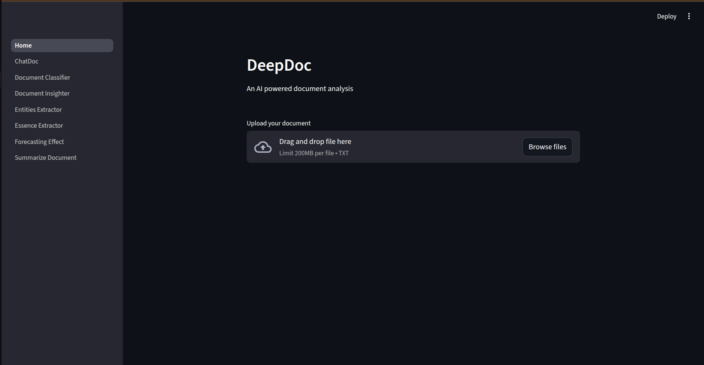 
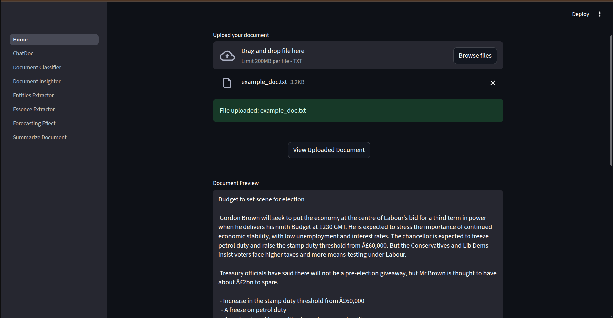 

### 🔹 Document Classifier UI  
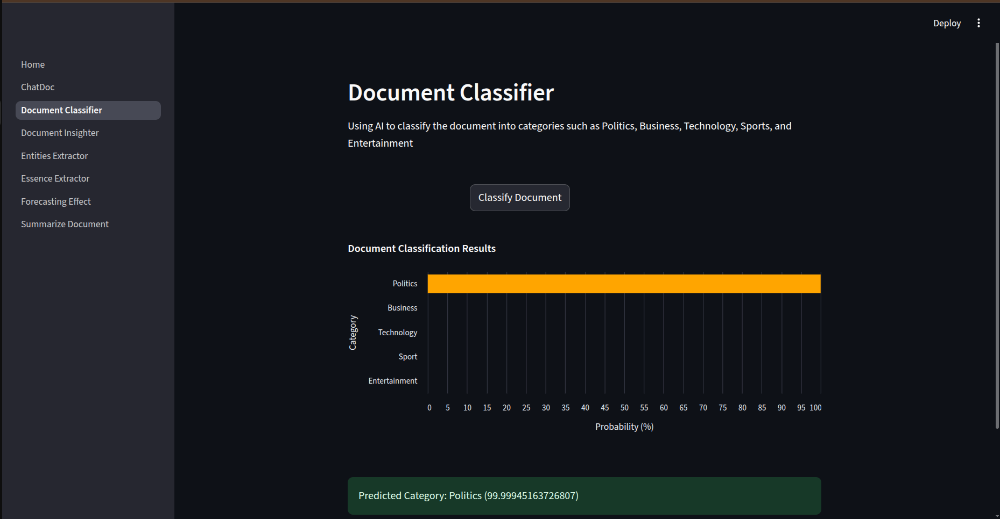  

### 🔹 Document Insighter UI  
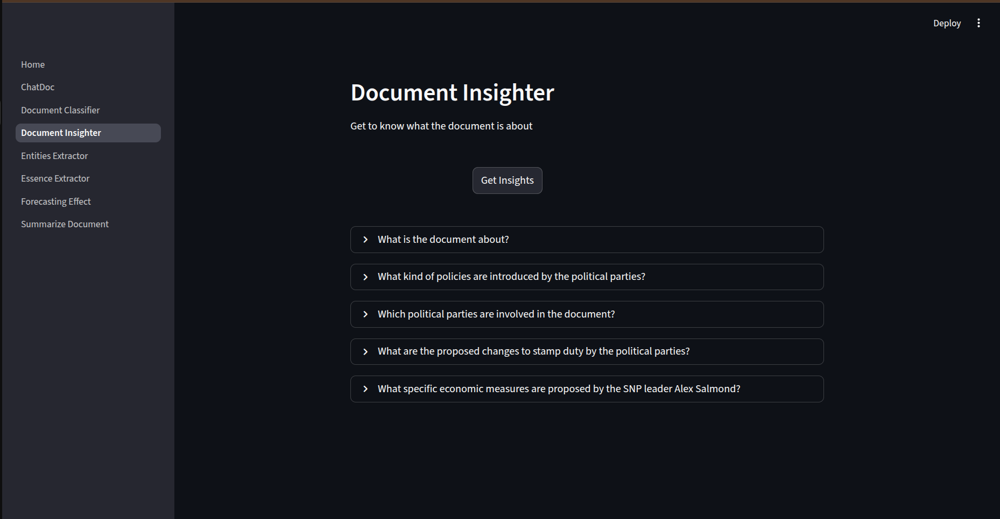
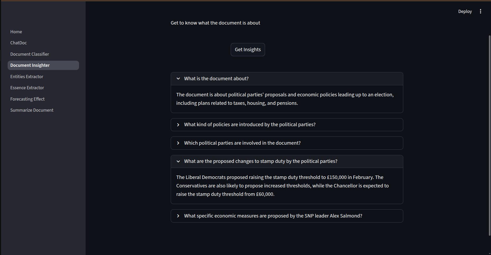

### 🔹 Essence Extractor UI  
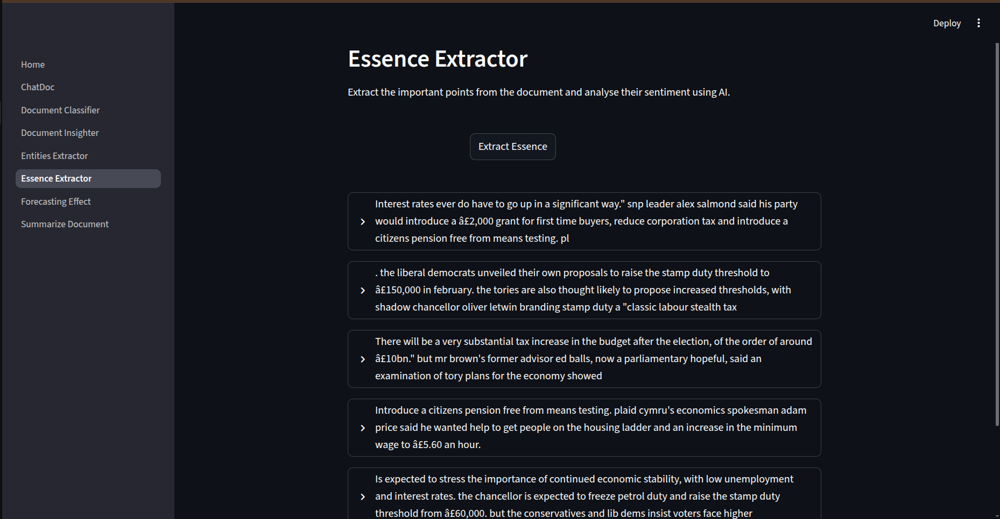
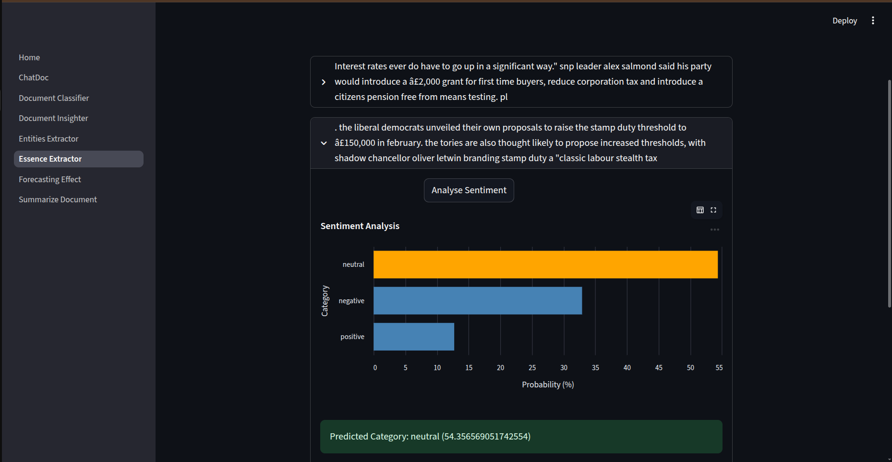
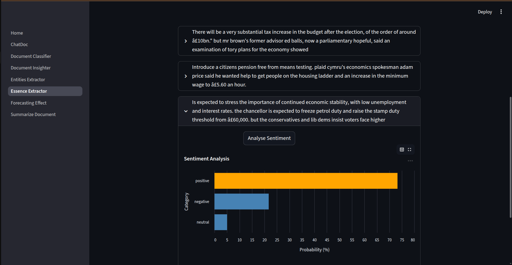

### 🔹 Effect Forecaster UI  
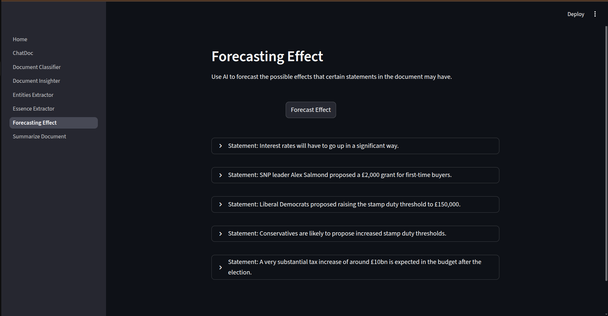 
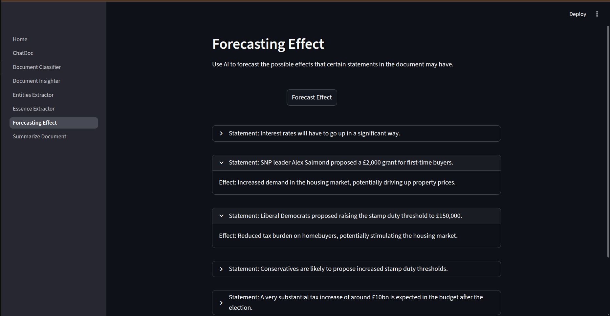 

### 🔹 ChatDoc UI  
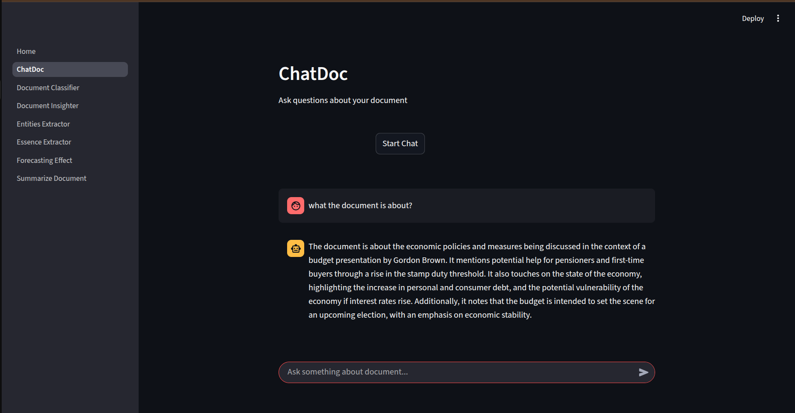
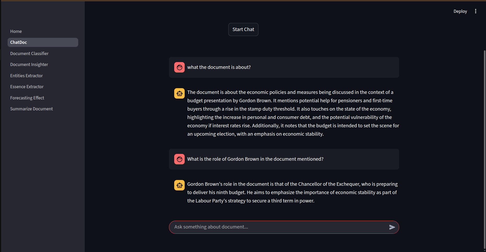  

### 🔹 Summarizer
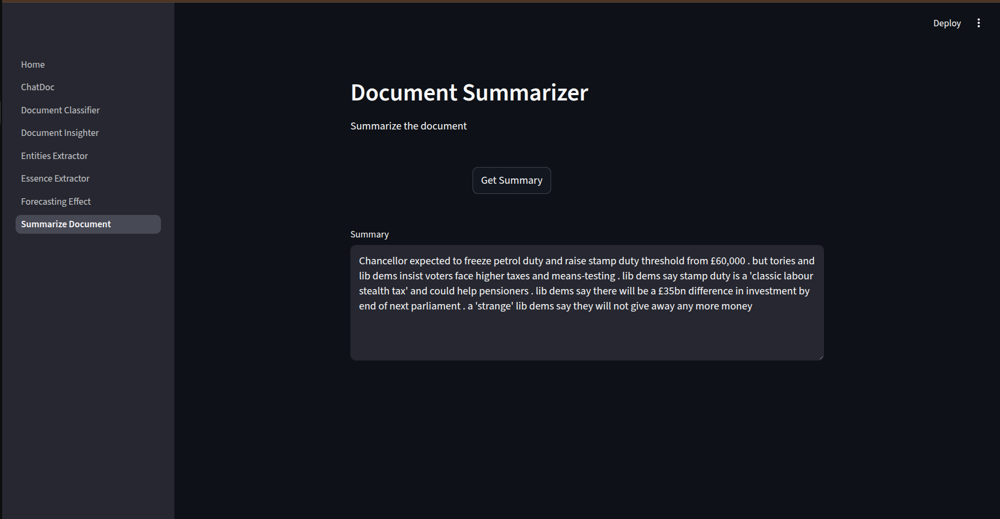 

---

## Getting Started:
1. Clone the repository:
   ```bash
   git clone https://github.com/spiralMonster/DeepDoc
   ```
2. Install dependencies:
   ```bash
   pip install -r requirements.txt
   ```
3. Run the chatbot:
   ```bash
   cd Frontend
   streamlit run Home.py
   ```

---

## Author

Developed by Amartya Pawar (spiralMonster)

